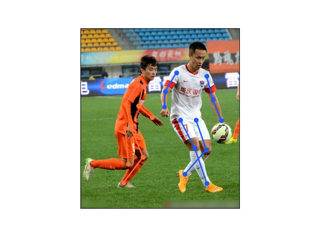

# Human Pose Estimation with TensorFlow



This is a modified version of [pose-tensorflow](https://github.com/eldar/pose-tensorflow) for [AI challenger](https://challenger.ai/)
I just train the model for 600000 iterations while the original project requires 1800000 iterations for multi-person pose estimation on COCO dataset.
So the final score is just 0.36.


Here you can find the implementation of the Human Body Pose Estimation algorithm,
presented in the [ArtTrack](http://arxiv.org/abs/1612.01465) and [DeeperCut](http://arxiv.org/abs/1605.03170) papers:

**Eldar Insafutdinov, Leonid Pishchulin, Bjoern Andres, Mykhaylo Andriluka and Bernt Schiele
DeeperCut:  A Deeper, Stronger, and Faster Multi-Person Pose Estimation Model.
In _European Conference on Computer Vision (ECCV)_, 2016**

**Eldar Insafutdinov, Mykhaylo Andriluka, Leonid Pishchulin, Siyu Tang, Evgeny Levinkov, Bjoern Andres and Bernt Schiele
ArtTrack: Articulated Multi-person Tracking in the Wild.
In _Conference on Computer Vision and Pattern Recognition (CVPR)_, 2017**

For more information visit http://pose.mpi-inf.mpg.de

Python 3 is required to run this code.
First of all, you should install TensorFlow as described in the
[official documentation](https://www.tensorflow.org/install/).
We recommended to use `virtualenv`.

You will also need to install the following Python packages:

```
$ pip3 install scipy scikit-image matplotlib pyyaml easydict cython munkres
```

When running training or prediction scripts, please make sure to set the environment variable
`TF_CUDNN_USE_AUTOTUNE` to 0 (see [this ticket](https://github.com/tensorflow/tensorflow/issues/5048)
for explanation).

If your machine has multiple GPUs, you can select which GPU you want to run on
by setting the environment variable, eg. `CUDA_VISIBLE_DEVICES=0`.

## Demo code
Multiple People

```
# Compile dependencies
$ ./compile.sh

# Download pre-trained model files
$ cd models/coco
$ ./download_models.sh
$ cd -

# Run demo of multi person pose estimation
$ TF_CUDNN_USE_AUTOTUNE=0 python3 demo/demo_multiperson.py
```

## Training models

Please follow these [instructions](models/README.md)
Before training the models you need to download the ImageNet pre-trained ResNet weights
```
$ cd models/pretrained
$ ./download.sh
```
Training parameters are specfied in th `pose_cfg.yml`file.
The author of the preliminary project provides 3 ways to train the models:
- Single person(with MPII Pose Dataset)
- Multi-person(with MS COCO dataset)
- train on my own dataset
I chosse the second way: training a model with MS COCO dataset (Multi-person)
1. Download the AI challenger dataset [keypoint datasets](https://challenger.ai/datasets/keypoint). Unpack it to the path `<path to dataset>`to have the following directory structure:
```
<path to dataset>/COCO/annotations/keypoint_train_annotations_20170909.json
<path to dataset>/COCO/images/train2014/*.jpg
```
2. transform the annotation format of AI challenger dataset to COCO format:
```
python ai2coco_art_neckhead_json.py --keypoint_json (<path to 'keypoint_train_annotations_20170909.json'>) --img_dir (train2014/)
```
3. the output json is in the same directory of keypoint_train_annotations_20170909.json's, rename the json: `coco_art_neckhead_keypoint_train_annotations_20170909.json` to `person_keypoints_train2014.json` and put it in the directory:
```
<path to dataset>/COCO/annotations/
```
4. Download pairwise statistics:
```
$ cd models/coco
$ ./download_models.sh
```
5. Edit the training definition file
`models/coco/train/pose_cfg.yaml`such that:
```
dataset: /scratch2/ygan/bisheng/fang/dataset/COCO
save_iters: 10000
```
6. Modify the models snapshots directory to the absolute directory in `train.py`, such that:
```
model_name = '/scratch2/ygan/bisheng/fang/pose-tensorflow/snapshots/' + cfg.snapshot_prefix
```

7. Train the model
```
$ cd models/coco/train/
$ TF_CUDNN_USE_AUTOTUNE=0 CUDA_VISIBLE_DEVICES=0 python3 ../../../train.py
```
*Note that:* there is no space around `=`in the above command `TF_CUDNN_USE_AUTOTUNE=0`and `CUDA_VISIBLE_DEVICES=0`

# Citation
Please cite ArtTrack and DeeperCut in your publications if it helps your research:

    @inproceedings{insafutdinov2017cvpr,
	    title = {ArtTrack: Articulated Multi-person Tracking in the Wild},
	    booktitle = {CVPR'17},
	    url = {http://arxiv.org/abs/1612.01465},
	    author = {Eldar Insafutdinov and Mykhaylo Andriluka and Leonid Pishchulin and Siyu Tang and Evgeny Levinkov and Bjoern Andres and Bernt Schiele}
    }

    @article{insafutdinov2016eccv,
        title = {DeeperCut: A Deeper, Stronger, and Faster Multi-Person Pose Estimation Model},
	    booktitle = {ECCV'16},
        url = {http://arxiv.org/abs/1605.03170},
        author = {Eldar Insafutdinov and Leonid Pishchulin and Bjoern Andres and Mykhaylo Andriluka and Bernt Schiele}
    }

# AI-challenger-pose-estimation
